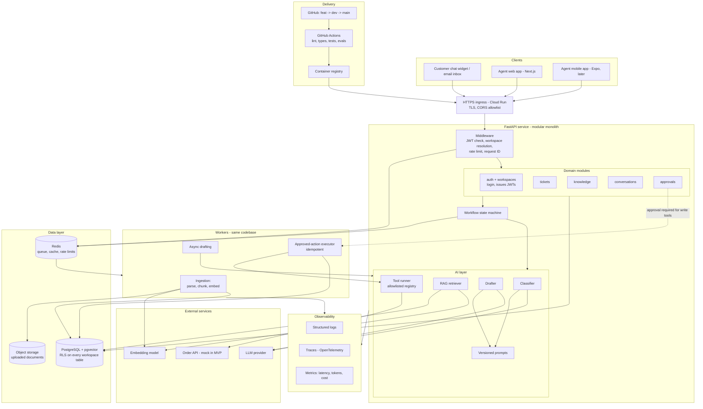
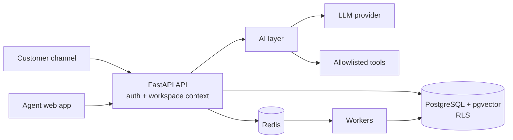
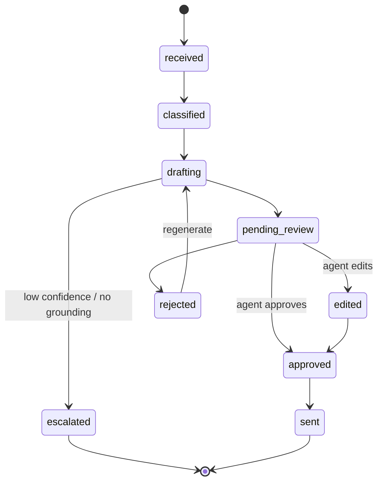

# ResolveAI: System Design

Every section follows the same pattern: **Decision**, **Why**, and **Rejected alternatives**. Later ADRs in `docs/adr/` should reference these sections.

---

## 1. Goals, constraints, non-goals

**Goals**

- Multi-tenant SaaS where a business's data is never visible to another business.
- AI *assists* agents: it retrieves, classifies, and drafts. Humans approve anything consequential.
- Production-minded: tested, observable, deployable, auditable.

**Constraints**

- Small team, 4 to 6 week MVP, so every choice favors simplicity and boring technology.
- One LLM provider, a mock order API, and web first (mobile deferred).

**Non-goals for the MVP**

- Real help-desk or e-commerce integrations, billing, voice, multilingual support, reranking, and MCP.

**Why write this down:** most over-engineering comes from unstated scope. When someone proposes Kubernetes or a multi-agent framework, this section is the answer.

---

## 2. Architecture overview

### 2.1 Complete system diagram



**How to read it**

1. A customer message enters through the gateway and middleware, which authenticates the caller and sets the tenant context (transaction-local `app.workspace_id` and `app.user_id`) for the database transaction.
2. A domain module stores the message, and the state machine moves the ticket to `classified`, then `drafting` (usually through a queued job).
3. The AI layer classifies the message, then either retrieves knowledge (RAG), calls a read-only tool, or creates an approval request for a write action.
4. The drafter produces a cited reply, which is saved as a draft in `pending_review`.
5. A human reviews it. Approved write actions are executed by a worker from the stored payload, never by the model.
6. Every step writes to the audit log and emits logs, traces, and metrics.

### 2.2 Overview (simplified)



**Decision:** a **modular monolith**. One FastAPI service with clear internal modules (`tickets`, `knowledge`, `conversations`, `approvals`, `ai`), plus a separate worker process built from the same codebase.

**Why**

- The domain is tightly coupled. A ticket, its conversation, its draft, and its approval change together, so transactions are far easier inside one service.
- One deployable means one CI pipeline and one set of logs for a small team.
- Module boundaries (each folder exposes a service interface, no reaching into another module's tables) let you extract services later if a real need appears.

**Rejected:** microservices. They add network failures, distributed transactions, and operational overhead with no benefit at this scale.

---

## 3. Multi-tenancy and data isolation

**Decision:** shared database, shared schema. A tenant is a **workspace** (`workspaces` table). Every workspace-owned table has a `workspace_id` column, and **PostgreSQL Row-Level Security (RLS)** enforces isolation.

Mechanics:

1. The auth dependency validates the access token and reads the user and workspace from it. The workspace in the token was verified against `memberships` when the token was issued (see Section 5).
2. Each request opens a transaction and sets transaction-local context: `set_config('app.workspace_id', <uuid>, true)` and `set_config('app.user_id', <uuid>, true)` (the `SET LOCAL` equivalent, with bound parameters).
3. RLS policies compare `workspace_id = current_setting('app.workspace_id')::uuid`. An unset setting becomes `NULL`, so a missing context matches no rows. `app.user_id` lets a user see their own memberships in other workspaces (for the workspace switcher), while writes are always limited to the current workspace.
4. The app connects as a **non-superuser role without `BYPASSRLS`**, and tables use `FORCE ROW LEVEL SECURITY`.
5. Migrations and admin tasks use a separate privileged role that the app never uses.
6. `users` and `refresh_tokens` are global identity tables without RLS. They are only reached through the auth service.

**Why**

- Application-level `WHERE workspace_id = ...` depends on every developer (and every AI agent) remembering it, every time. RLS makes the database the last line of defense, so a forgotten filter returns zero rows instead of leaking data.
- Vector search also has to be tenant-scoped, and RLS covers the `chunks` table too.
- `SET LOCAL` is scoped to the transaction, so a pooled connection can't carry one tenant's context into the next request.

**Rejected**

- *Schema-per-tenant or DB-per-tenant:* stronger isolation but painful migrations and connection management at scale. Consider it later only for enterprise customers who demand it.
- *App-layer filtering only:* one missed filter is a breach.

**Mandatory test:** a cross-tenant leak test in CI. Create Workspace A and B data, query as A, and assert that B's rows are never returned from any endpoint, including search.

---

## 4. Data model

| Table | Purpose | Key columns |
| --- | --- | --- |
| `workspaces` | A business workspace (the tenant) | id, name, slug, widget_public_key, allowed_origins, settings (jsonb), created_at |
| `users` | Identity (global, no RLS) | id, email, password_hash, full_name, is_active |
| `refresh_tokens` | Refresh sessions (global, no RLS) | id, user_id, workspace_id, token_hash, family_id, expires_at, revoked_at, replaced_by_id |
| `memberships` | User ↔ workspace with role | workspace_id, user_id, role (`owner`, `admin`, `agent`) |
| `documents` | Uploaded knowledge sources | workspace_id, title, source_type, status, content_hash |
| `chunks` | Text pieces + embeddings | workspace_id, document_id, content, embedding (vector), position, metadata |
| `tickets` | Support requests | workspace_id, status, category, priority, intent, assigned_to |
| `conversations` | Thread per ticket/customer | workspace_id, ticket_id, channel |
| `messages` | Individual messages | workspace_id, conversation_id, sender_type (`customer`, `agent`, `ai`), body |
| `drafts` | AI-proposed replies | workspace_id, ticket_id, body, citations (jsonb), status, model_version, prompt_version |
| `approvals` | Gated actions | workspace_id, ticket_id, action_type, payload (jsonb), status, requested_by, decided_by, idempotency_key |
| `tool_calls` | Every tool invocation | workspace_id, ticket_id, tool_name, args (jsonb), result_summary, status, latency_ms |
| `feedback` | Agent/customer ratings | workspace_id, draft_id, rating, edited_body |
| `llm_usage` | Cost tracking | workspace_id, model, prompt_tokens, completion_tokens, cost, latency_ms |
| `audit_log` | Append-only record | workspace_id, actor, action, entity, entity_id, before/after, at |

**Why**

- **Separate `drafts` from `messages`.** A draft is a proposal. A message is something that was actually sent. Mixing them makes it easy to accidentally send unapproved text.
- **`approvals` is its own table** with a payload and idempotency key, so a refund is a durable, reviewable record and cannot execute twice.
- **`drafts` stores `model_version` and `prompt_version`,** so when quality changes you can tell why.
- **`audit_log` is append-only** (no UPDATE or DELETE grants). It is your evidence trail for sensitive actions.
- **`workspace_id` is denormalized onto every workspace-owned table** (even child tables like `messages`) so RLS policies are simple, fast, and never need joins.
- Use UUIDs for IDs so they aren't guessable, and add composite indexes starting with `workspace_id`.

---

## 5. Authentication and authorization

**Decision:** the API runs its own authentication (`services/api/app/core/security.py`, `app/modules/auth/`) and enforces role-based access (RBAC).

- **Credentials:** email + password. Passwords are hashed with **argon2** (`argon2-cffi`). Login spends the same hashing time for unknown emails, so response timing doesn't reveal which emails are registered.
- **Access token:** a JWT (HS256) that lives **15 minutes**, with claims `sub` (user ID), `wid` (workspace ID), `role`, plus `type`, `iat`, `exp`. It is sent as a `Bearer` header.
- **Refresh token:** an opaque random token that lives **30 days**. Only its SHA-256 hash is stored in `refresh_tokens`, together with the `workspace_id` the session is active in. The raw token is sent to the browser as an `httpOnly` cookie scoped to `/api/v1/auth`.
- **Rotation:** every refresh issues a new token in the same family and revokes the old one (`replaced_by_id`, `revoked_at`). Membership and `is_active` are re-checked on every refresh.
- **Reuse detection:** presenting a token that was already rotated or revoked is treated as theft, and the **whole family is revoked**.
- **Workspace switching:** a user with several memberships calls `/workspaces/{id}/switch`. The server verifies the membership and issues tokens for that workspace.

| Role | Can do |
| --- | --- |
| `owner` | Everything, including deleting the workspace |
| `admin` | Manage members, knowledge base, settings; approve sensitive actions (refunds, account changes) |
| `agent` | Handle tickets, edit drafts, approve low-risk actions |

**Why**

- Full control over the auth flow and the token claims (the workspace and role live in the token), with no extra vendor to integrate, pay for, or depend on.
- Learning value: the team owns and understands every step of the session lifecycle.
- Short-lived access tokens limit the damage of a leaked token. Rotating, hashed refresh tokens with family revocation make a stolen refresh token detectable and short-lived.
- Workspace context comes from the **server-side membership lookup**, never from a client-supplied `workspace_id`. A client can *select* among workspaces it belongs to, but the server verifies membership.
- Authorization is checked at two layers: role checks in the API (what you may do) and RLS in the database (which rows exist for you).

**Rejected:** a managed auth provider (Clerk, Auth0, or Supabase Auth). It would take password storage, MFA, and account recovery off our hands, but costs control and adds a vendor. It can be revisited later (for example, for SSO or MFA requirements).

**Customer-facing channel:** customers are not users. They authenticate with a per-workspace, scoped widget key or signed token, with tight rate limits and no access beyond submitting messages and reading their own thread.

---

## 6. API design

**Decision:** REST over HTTPS with FastAPI + Pydantic, versioned under `/api/v1`. OpenAPI is generated automatically, and a typed TypeScript client is generated from it for web and mobile.

Main resources: `/tickets`, `/tickets/{id}/messages`, `/tickets/{id}/drafts`, `/drafts/{id}/approve`, `/approvals`, `/documents`, `/knowledge/search`, `/analytics`, `/feedback`.

**Conventions**

- Pydantic models validate every request and response.
- Long operations (document ingestion, drafting) return `202 Accepted` plus a status resource, and the client polls or subscribes.
- Consequential POSTs accept an `Idempotency-Key` header.
- Cursor pagination on lists, and a consistent error shape with a request ID.

**Why**

- The generated client eliminates a whole class of frontend/backend drift bugs.
- Async endpoints prevent LLM latency (seconds) from tying up request threads or hitting gateway timeouts.
- Idempotency keys make client retries safe.

**Rejected:** GraphQL (extra complexity, no need), gRPC (browser and mobile friction).

**Real-time updates:** start with polling or Server-Sent Events for new drafts and ticket changes. Add WebSockets only if SSE proves insufficient.

---

## 7. Knowledge ingestion and RAG pipeline

**Ingestion (async, in workers)**

1. Upload → store the original file in object storage (a GCS bucket; local disk in dev) and create a `documents` row with status `pending`.
2. Worker parses text (PDF, DOCX, MD, TXT).
3. Chunk into about 500 to 800 tokens with 10 to 15% overlap, preserving headings as metadata.
4. Embed in batches and insert into `chunks` with `workspace_id`.
5. Mark the document `ready` or `failed` (with a reason).

**Query flow**

1. Rewrite the customer message into a standalone query (only if the conversation needs it).
2. Embed the query, then run a **tenant-scoped** top-k vector search (k of about 5 to 8).
3. Apply a **similarity threshold**. If nothing is relevant enough, do *not* answer from the model's general knowledge. Escalate to a human.
4. Build the prompt with retrieved chunks as clearly delimited, untrusted context.
5. Generate an answer that must include citations (chunk/document IDs), then validate that the citations refer to retrieved chunks.

**Why**

- Chunk size is a tradeoff: too small loses context, too large dilutes relevance. This range is a sensible starting point, and the eval set tells you whether to tune it.
- Ingestion is slow and failure-prone (bad PDFs, provider errors), so it must be a retryable background job, not a request handler.
- The threshold and the "escalate instead of guess" rule are what make this *grounded*. A confident wrong answer about a refund policy is worse than no answer.
- Content hashing avoids re-embedding unchanged documents.

**Why pgvector, not a dedicated vector DB:** vectors live beside the relational data, so one query can filter by tenant, document status, and metadata, and RLS applies automatically. Tens of thousands of chunks per tenant is well within pgvector's range. Use an HNSW index. Revisit if you reach many millions of vectors.

**Later:** hybrid search (Postgres full-text + vector) and reranking, once evals show retrieval misses.

---

## 8. Ticket classification and routing

**Decision:** one LLM call per inbound message returns a **schema-validated** object:

```json
{ "intent": "order_status | refund_request | policy_question | complaint | other",
  "category": "...", "priority": "low | normal | high | urgent",
  "confidence": 0.0, "needs_human": false }
```

Routing is deterministic code that consumes this output (assignment rules, urgent flagging).

**Why**

- Structured output plus Pydantic validation means a malformed response is caught, retried once, and then falls back to `intent: other, needs_human: true`.
- The LLM *classifies*, but ordinary code *routes*. That keeps business rules testable and auditable.
- Low confidence never fails silently. It routes to a human.
- Intent drives the next step: `order_status` → tool path, `policy_question` → RAG path, `refund_request` → approval path.

---

## 9. Tool calling

**Decision:** a registry of **allowlisted, typed tools**. MVP tools:

| Tool | Side effects | Approval needed |
| --- | --- | --- |
| `get_order_status(order_id)` | None (read-only) | No |
| `check_refund_eligibility(order_id)` | None (read-only) | No |
| `create_ticket(...)` | Internal | No |
| `issue_refund(order_id, amount)` | **Yes** | **Yes, always** |

Rules:

- Each tool has a Pydantic input schema, a timeout, bounded retries, and a declared side-effect level.
- The **workspace ID is injected by the runtime**, never taken from model output. The model cannot ask for another workspace's order.
- Arguments are validated against the schema *and* against business checks (for example, the order belongs to this workspace and customer).
- The model can never supply a URL or SQL. Tools call fixed, configured endpoints.
- Write tools do not execute when the model requests them. They create an `approvals` row (see Section 10).
- Every call is logged in `tool_calls`.

**Why:** the model is an untrusted planner. Treating it like a user-facing form (validate everything, permit little) is what makes tool use safe. Separating read tools from write tools means the worst a manipulated model can do is read data the customer is already entitled to, and even that is scoped to the workspace.

**MCP:** deferred. Wrap tools behind the same internal interface now, so an MCP server can expose them later without rewriting business logic.

---

## 10. Workflow orchestration and human-in-the-loop

**Decision:** an explicit state machine persisted in Postgres, written as plain Python for the MVP (LangGraph is optional later).

**Ticket/draft lifecycle**



**Action approval lifecycle (refunds etc.)**

`proposed → approved → executing → executed | failed`, or `proposed → rejected`.

Rules:

- Executing is done by a worker using the stored approved payload and its idempotency key, not by re-asking the model.
- The approver's identity, timestamp, and the exact payload are written to `audit_log`.
- The approver must hold the required role, and (configurable) should differ from the requester.
- If the payload changes after approval, the approval is invalidated.

**Why**

- Persisted states survive restarts and make "where is this ticket?" answerable. A hidden in-memory agent loop does not.
- Human approval is enforced by the **state machine and database**, not by the prompt. A prompt can be argued around, but a `status` check cannot.
- Executing the *approved payload* (not regenerating it) means what the human reviewed is exactly what runs.

---

## 11. Background jobs and reliability

**Decision:** **arq**, a Redis-backed async job queue, with workers built from the same codebase.

Every job has: a retry policy with exponential backoff and a cap, a timeout, an idempotency key, and a dead-letter state that alerts and is visible in the dashboard.

**Jobs:** document ingestion, embedding batches, async drafting, refund execution, usage aggregation.

**Why**

- LLM and external API calls fail and slow down. Bounded retries handle transient failures without infinite loops or runaway cost.
- Idempotency handles the classic at-least-once delivery problem, so a retried refund job never refunds twice.
- Redis is already needed for rate limiting and caching, so no extra infrastructure.
- arq is asyncio-native, so jobs reuse the same async SQLAlchemy sessions, tenant-context helpers, and service code as the API instead of a parallel sync stack.

**Rejected**

- *Celery:* mature, but sync-first. Async SQLAlchemy code would need wrappers or a second sync data layer, and it brings more configuration and moving parts than this MVP needs.
- *RQ:* simple, but sync-only, with the same mismatch with the async codebase.

**Consider later:** Postgres-based queues if you want to remove Redis from the critical path (transactional enqueue).

---

## 12. Security

| Threat | Mitigation |
| --- | --- |
| Cross-tenant data access | RLS + tenant-scoped queries + CI leak tests |
| Prompt injection (in documents or customer messages) | Treat all retrieved and customer text as data. Delimit it, tell the model it is untrusted, and never let it change tool permissions. Validate outputs. **Structural defense: write actions need human approval regardless of what the model says.** |
| Malicious tool arguments | Strict schemas, server-injected workspace ID, no model-supplied URLs or SQL |
| Data exfiltration via model output | Output schemas, citation checks, no tool that sends data externally |
| Abuse / cost attacks | Per-tenant and per-IP rate limits, token budgets, max input sizes |
| Malicious uploads | File type and size limits, parse in the worker (not the API), no code execution |
| Secrets leakage | Environment/secret manager only, `.env` gitignored, secret scanning in CI |
| PII in logs | Redaction, log IDs and metadata instead of full message bodies |
| Insider misuse | Roles, approval separation, append-only audit log |

**Why the structural defense matters:** prompt-injection defenses in prompts are *probabilistic*. You cannot prove they hold. Architecture that limits what a fooled model *can do* (read-only tools, approval gates, tenant injection) is *deterministic*. Design assuming the model will sometimes be tricked.

Also: HTTPS everywhere, CORS locked to your web origin, dependency scanning (Dependabot), and encrypted database and storage at rest.

---

## 13. Observability

**Decision:** structured JSON logs, distributed traces (OpenTelemetry), and metrics, with a request ID propagated across API, worker, and LLM calls.

Track per request: workspace ID, model version, prompt version, retrieval scores, tool calls, token counts, cost, and latency (broken down by retrieval, LLM, and tools).

**Dashboards and alerts**

- p50/p95 latency, error rate, queue depth, dead-lettered jobs
- Cost per tenant per day, with a budget alert
- Feedback trends: approval rate, edit rate, and thumbs up/down on drafts

**Why**

- Cost and latency are product risks in AI systems, not just ops details.
- **Edit rate** (how often agents change the draft) is your most honest real-world quality signal.
- Without traces, "the AI gave a bad answer" is not debuggable. With them you can see exactly which chunks and prompt version produced it.

Start with structured logs and a basic tracing tool (Langfuse, Sentry, or Cloud Trace). Do not build a custom observability platform.

---

## 14. Evaluation

**Decision:** a repeatable eval suite in `/evals`, run locally and in CI on prompt or retrieval changes.

| Eval | Measures | Starting set |
| --- | --- | --- |
| Retrieval | Is the right chunk in the top-k? (recall@k) | 30 to 50 question → source pairs |
| Grounding | Is every claim supported? Are citations valid? Does it refuse when it should? | Includes unanswerable questions |
| Classification | Intent/priority accuracy, confusion matrix | 100 labeled messages |
| Tool selection | Right tool, right args, no tool when none needed | 30 scenarios |
| Safety | Injection attempts, cross-tenant requests, refund without approval | 20+ adversarial cases |

**Why**

- Without evals, every prompt change is guesswork, and regressions ship silently.
- Adversarial cases are tests for your security claims.
- Start small in Week 2. A dataset of 30 examples that exists beats a perfect one that doesn't.

Gate merges on a defined threshold (for example, no drop in classification accuracy or safety pass rate).

---

## 15. Deployment and environments

**Decision**

- **Local:** docker-compose (Postgres + pgvector, Redis, API, worker, web).
- **CI:** GitHub Actions runs lint, type-check, unit and integration tests (with a real Postgres service container so RLS is truly tested), and the build.
- **Environments:** `dev` (auto-deploy from the `dev` branch) and `prod` (deploy from `main` on tagged release).
- **Runtime:** Cloud Run for the API, worker, and web. Managed PostgreSQL (Cloud SQL or a provider with pgvector support), managed Redis (Memorystore or an equivalent), and Secret Manager.
- **Migrations:** Alembic, run as a controlled step before rollout, always backward compatible with the previous release.

**Why**

- Cloud Run gives containers, autoscaling, and HTTPS with very little ops work, which suits a small team.
- Testing RLS against a mocked database proves nothing, so CI uses real Postgres.
- Mapping branches to environments matches your `dev`/`main` workflow: merging to `dev` gives you a live integration environment, and tagging `main` promotes to production.

---

## 16. Scaling and failure modes

**Expected bottlenecks (in order)**

1. LLM latency and rate limits → async drafting, queues, per-tenant token budgets, provider retry with backoff.
2. Embedding throughput during large uploads → batching and worker concurrency.
3. Database connections → pooling (PgBouncer in transaction mode works with `SET LOCAL`).
4. Vector search at scale → HNSW tuning, then partitioning or a dedicated vector store.

**Failure behavior (design for it explicitly)**

| Failure | Behavior |
| --- | --- |
| LLM provider down | Ticket goes to a human queue with no draft. Nothing is lost. |
| Order API timeout | Retry (bounded), then draft says the lookup failed and flags the agent |
| Worker crash mid-job | Job is retried. Idempotency prevents duplicates. |
| Retrieval finds nothing relevant | Escalate, don't guess |
| Invalid model output | Retry once, then fall back to human handling |

**Why:** for a support tool, "degrade to human" is always an acceptable fallback. The system should never fail silently or invent an answer.

---

## 17. Build order and ADR list

Build in dependency order: **foundation → tenancy/RLS → knowledge/RAG → tickets + classification → tools → approvals → quality → release.** This matches your 6-week plan.

**ADRs to write first**

1. Modular monolith
2. Shared schema + RLS tenancy
3. Own JWT auth with rotating refresh tokens
4. pgvector for embeddings
5. arq for background jobs
6. State machine over an autonomous agent loop
7. REST tools now, MCP later
8. LLM provider and embedding model choice

**Open questions for the team**

- Which LLM and embedding model? (This fixes the vector dimension, so decide before the first migration.)
- Is the repo private? (This affects branch protection features.)

**Answered**

- How are customers reaching the system in the MVP? Embedded chat widget for the MVP; email later.